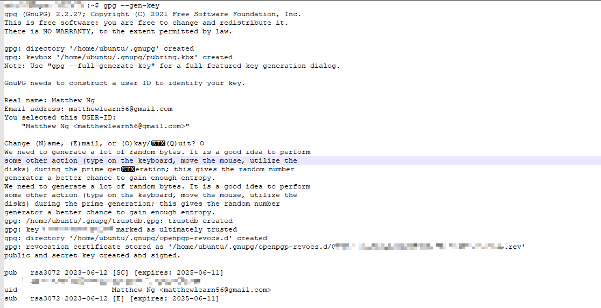

# How to deploy to maven central [Gradle]


Recently I developed a package to manage the session of Spring framework using Cassandra DB. Because of self-developed, I have to make the imported as below, which is not recommended.

```xml
<dependency>
    <groupId>org.springframework.session.data.cassandra</groupId>
    <artifactId>spring-session-cassandra</artifactId>
    <version>0.1</version>
    <scope>system</scope>
    <systemPath>${project.basedir}/src/main/resources/lib/spring-session-cassandra-0.1.jar</systemPath>
</dependency>
```

Also, I believe this project is also useful to those needed to use the Cassandra DB to manage the Session, therefore here I am to show how to deploy a project to the maven central.

---

**Tips:**

While I try to deploy my project to the maven central, I follow many instruction from the Internet, but no one can let me follow from head to tail. Therefore, I decided to write my own one. Also, there is another thing I always encounter when I try to follow others instruction even the official website one, **the Version problem**. The syntax of different version of the different tools can be huge different. Below is the detail version of the tools I used in this article. Ensure you are using the same/similar version with me.

``` 
gardle == 7.6.1
gpg (GnuPG) == 2.2.27
java == 11 (This one may not affect the publish environment)
```

---

## 1. Background of the maven central

Maven Central is a repository that stores binary artifacts for software libraries and frameworks written in Java and related languages. It serves as the default repository for Apache Maven, a popular build automation tool used in Java development, as well as other dependency management tools like Gradle and sbt.

Maven Central is operated by **Sonatype**, a company that provides software supply chain automation services to organizations around the world.

In order for a library or framework to be included in Maven Central, it must first go through a process called "**staging**", where it is reviewed and tested by Sonatype's team to ensure that it meets certain quality and stability standards. Once approved, the artifact is published to Maven Central and can be easily accessed by developers using tools like Maven or Gradle.

## 2. Upload the source code to Github

Before doing all the below works, you need to first upload the project to github.com or other platfom

## 3. Create a Sonatype Jira account and create issue

Sonatype use  JIRA to manage the issue related to the maven central. 

[Sign up for Jira - Sonatype JIRA](https://issues.sonatype.org/secure/Signup!default.jspa)

After  you have a JIRA account, you can create a issue.

[Create Issue - Sonatype JIRA](https://issues.sonatype.org/secure/CreateIssue.jspa?pid=10134&issuetype=21)

In the create issue page you will see the below page, there are few information you must fill in: 


After created, you will see the below page, the next steps is to wait for the Assignee to review the issue.


---

**Tips**

If you didn't own the groupID, in my case, i should own ngmatthew227.com, it will ask me to prove I own this domain. It also provide how should I do if you didn't own the domain, just follow it's guide, then reopen the issue.


In my case, I changed into **io.github.ngmatthew227**

---

If everything is fine, you should able to see the issue's status become Resolved and the below message, then you can process to next step


## 4. Prepare the PGP Key

For the package upload to the maven central, it must signed with the pgp. Therefore, we need prepare our own pgp key. The below process is run in **linux**.

1. **Install gpg on Ubuntu**
   
   ```shell
   sudo apt-get update
   sudo apt-get install gnupg
   gpg --help
   gpg --version
   # my version is gpg (GnuPG) 2.2.27
   # the syntax of different version may different
   ```

2. **Generate Key**
   
   Run the below command and enter the name and email and password, then it will generate a key for you. **Remember the password and the unique key, it will be useful later.**
   
   After you generate the key, you can run `gpg --list-keys` to check all the existing keys
   
   ```shell
   gpg --gen-key
   ```

        

3. **Export the Key**
   
   The tools will generate a pair of public key and private key. The public key will uploaded to key server for maven central to download / access. The private key will be used to sign the project when publish to the maven central.
   
   ```shell
   # upload the public key the key server
   gpg --keyserver hkp://keys.openpgp.org --send-keys ${your unique key here}
   
   # export the private key, it will ask you to enter the password of the key you set before
   gpg --export-secret-keys -o secring.gpg
   ```

4. Copy the `secring.gpg` to the root of the project

---

**Tips**

Different version of gpg tools in Linux may have different syntax, you may align the version of gpg with mine one or use the correct syntax under the version

---

## 5. Prepare the POM file

The maven central required user fulfill the following requirement when they try to release the project to public:

- [ ] Signed by gpg

- [ ] Provide sources code

- [ ] Provide Javadoc

- [ ] Valid POM information

Now we are going to modify our build.gradle file to achieve the above requirement. Below is the example:

```groovy
// Define the plugins used for this project
plugins {
  id 'java-library'
  id 'maven-publish'
  id 'signing'
}

// Define the repositories used to download dependencies
repositories {
  mavenCentral()
}

// Define project details
group = 'io.github.ngmatthew227'
description = 'Spring Session for Cassandra'
archivesBaseName = 'spring-session-cassandra'
version = '1.0'

// Generate JARs with JavaDoc and source code
java {
 withJavadocJar()
 withSourcesJar()
}

// Define project dependencies
dependencies {
 implementation 'org.springframework.session:spring-session-core:2.7.1'
 implementation 'org.springframework.data:spring-data-cassandra:3.4.11'
}

// Define how the artifact should be published
publishing {
  publications {
  // Define a Maven publication named "mavenJava"
 mavenJava(MavenPublication) {
    // Specify the coordinates of the artifact
   groupId = 'io.github.ngmatthew227'
   artifactId = 'spring-session-cassandra'
   version = '1.0'

   // Include the compiled Java code in the JAR file
   from components.java

   // Configure the POM file for the artifact
   pom {
     name = 'Spring Session Cassandra'
     description = 'Spring Session Cassandra provides SessionRepository implementation backed by Cassandra.'
     url = 'https://github.com/ngmatthew227/spring-session-cassandra'
     licenses {
       license {
         name = 'MIT License'
         url = 'http://www.opensource.org/licenses/mit-license.php'
       }
     }

      // Specify information about the developers of the project
     developers {
       developer {
         id = 'ngmatthew227'
         name = 'Matthew Ng'
         email = 'matthewlearn56@gmail.com'
       }
     }

     // Specify SCM information for the artifact
     scm {
       connection = 'scm:git:git://github.com/ngmatthew227/spring-session-cassandra.git'
       developerConnection = 'scm:git:git://github.com/ngmatthew227/spring-session-cassandra.git'
       url = 'http://github.com/ngmatthew227/spring-session-cassandra'
     }
   }
 }
  }

  // Define the Maven repository to publish artifacts to
  repositories {
 maven {
   url = uri('https://s01.oss.sonatype.org/service/local/staging/deploy/maven2/')
   credentials {
     username ossrhUsername // username for repository authentication
     password ossrhPassword // password for repository authentication
   }
 }
  }
}

// Sign the published artifacts with a GPG key
signing {
 sign publishing.publications.mavenJava
}

// Generate JavaDoc
javadoc {
 if(JavaVersion.current().isJava9Compatible()) {
     options.addBooleanOption('html5', true)
 }
}
```

As you can see the `ossrhUsername` and the `ossrhPassword` is not set in the build.gradle file, we have to create another file `gradle.properties` to store those data:

```groovy
ossrhUsername=${your jira acct username}
ossrhPassword=${your jira acct password}

signing.keyId=${your gpg key last 8 digit}
signing.password=${your gpg key password}
signing.secretKeyRingFile=secring.gpg
```

After you done all the above work. You can now finally go to our final step!! 👏👏👏


## 6. Publish ✨ ⭐ 🌟

The process of publish as this: upload to nexus repo -> close -> release.

Run the below command under the cmd

```shell
gradlew publish
```


After you run the above command, the library should now uploaded to nexus repository manager. Login with your Jira username and password.

[Nexus Repository Manager](https://s01.oss.sonatype.org/#stagingRepositories)


You should able to see a new line in the Staging Repositories and the status is open as below. Click close, it will start to run the validation process. If the validation is passed. Click the Release button, after around 2 hours, you would able to check your library at maven central. 👍 👍


You can click the Activity tab at the bottom panel to view the process of validation, if it failed, the detail reason will also shown here.


Now, you can search your library at [Maven Central.](https://central.sonatype.com/) Congratulations!!


